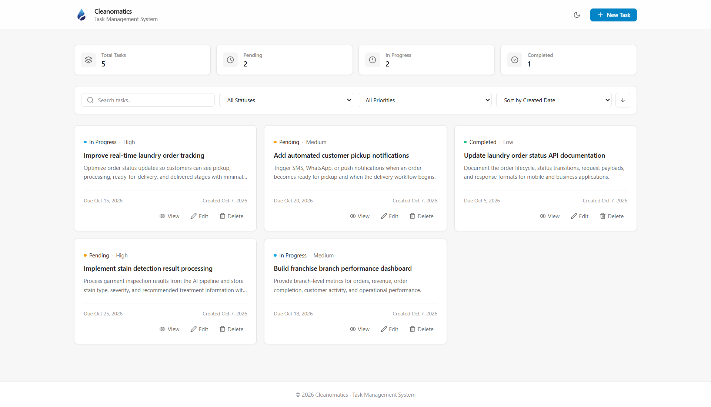
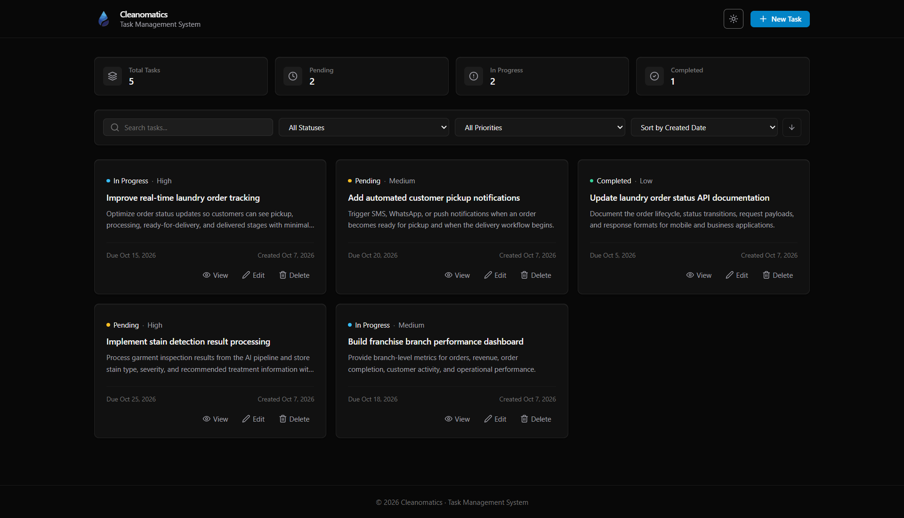
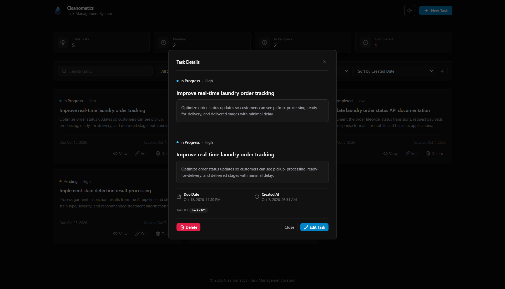
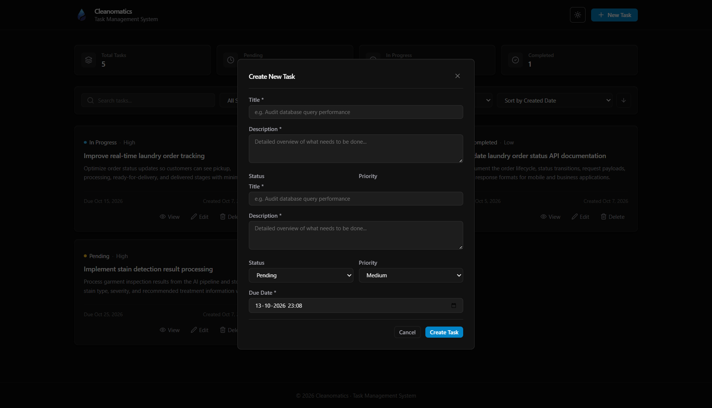

# Cleanomatics Task Management System

A full-stack task management application built for the Cleanomatics Software Engineering Intern assignment. The project has a FastAPI backend with in-memory storage and a Next.js frontend built with React, TypeScript, and Tailwind CSS.

The application supports creating, viewing, editing, and deleting tasks, along with search, filtering, sorting, validation, and light and dark themes.

## Features

- Create, view, edit, and delete tasks
- Task status tracking (`pending`, `in_progress`, `completed`)
- Task priority levels (`low`, `medium`, `high`)
- Due dates and timestamps
- Search across task titles and descriptions
- Filter by status and priority
- Sort by created date, due date, priority, or title
- Ascending and descending sort order
- Client-side and server-side validation
- Centralized error handling
- Responsive layout
- Light and dark mode
- Loading, empty, and error states
- Swagger UI / OpenAPI documentation
- Automated backend tests with Pytest

## Tech Stack

| Part | Technology |
|---|---|
| Frontend | Next.js 14, React 18, TypeScript |
| Styling | Tailwind CSS |
| Icons | Lucide React |
| Backend | Python 3.13, FastAPI |
| Validation | Pydantic v2 |
| Server | Uvicorn |
| Storage | In-memory Python dictionary |
| Testing | Pytest, HTTPX |

## Project Structure

```text
cleanomatics-task-management-system/
├── backend/
│   ├── app/
│   │   ├── controllers/
│   │   ├── middleware/
│   │   ├── routes/
│   │   ├── schemas/
│   │   ├── services/
│   │   ├── main.py
│   │   └── store.py
│   ├── tests/
│   │   ├── conftest.py
│   │   └── test_tasks.py
│   ├── .env.example
│   └── requirements.txt
├── frontend/
│   ├── app/
│   ├── components/
│   │   ├── layout/
│   │   ├── tasks/
│   │   └── ui/
│   ├── hooks/
│   ├── services/
│   ├── types/
│   ├── .env.example
│   └── package.json
└── README.md
```

The backend is separated into a few simple layers:

- **Routes** define the API endpoints and query parameters.
- **Controllers** handle requests and responses and coordinate with the service layer.
- **Services** contain the task logic for searching, filtering, sorting, and CRUD operations.
- **Schemas** define the request and response models using Pydantic.
- **Middleware** handles request validation and API errors.
- **Store** keeps the tasks in memory while the server is running.

The frontend is organized around reusable components, custom hooks, and a small API client for communicating with the backend.

## Getting Started

### 1. Clone the repository

```bash
git clone https://github.com/ShivanshJainSJ/cleanomatics-task-management-system.git 
cd cleanomatics-task-management-system
```

### 2. Backend Setup

```powershell
cd backend
python -m venv .venv
.venv\Scripts\activate
pip install -r requirements.txt
uvicorn app.main:app --reload
```

The backend will be available at:

`http://localhost:8000`

For local development, the default configuration can be used without creating a `.env` file. Optional settings are documented in `backend/.env.example`.

### 3. Frontend Setup

Open a new terminal:

```bash
cd frontend
npm install
npm run dev
```

The frontend will be available at:

`http://localhost:3000`

By default, the frontend connects to the backend at `http://localhost:8000`.

To use a different backend URL, set `NEXT_PUBLIC_API_URL` in `frontend/.env.local`.

## Running the Application

- Frontend: `http://localhost:3000`
- Backend: `http://localhost:8000`
- Swagger UI: `http://localhost:8000/docs`
- ReDoc: `http://localhost:8000/redoc`

## API Endpoints

| Method | Endpoint | Purpose |
|---|---|---|
| `GET` | `/api/tasks` | List tasks |
| `GET` | `/api/tasks/{id}` | Get a single task |
| `POST` | `/api/tasks` | Create a task |
| `PUT` | `/api/tasks/{id}` | Update a task |
| `DELETE` | `/api/tasks/{id}` | Delete a task |
| `GET` | `/health` | Health check |

### GET /api/tasks

The task list endpoint supports the following query parameters:

| Parameter | Purpose |
|---|---|
| `search` | Search title and description |
| `status` | Filter by task status |
| `priority` | Filter by priority |
| `sort_by` | Sort by `createdAt`, `dueDate`, `priority`, or `title` |
| `sort_order` | Sort using `asc` or `desc` |

Search is case-insensitive.

## Task Model

Each task contains:

- `id` — unique task identifier
- `title` — task title
- `description` — task description
- `status` — `pending`, `in_progress`, or `completed`
- `priority` — `low`, `medium`, or `high`
- `dueDate` — required due date
- `createdAt` — creation timestamp
- `updatedAt` — last update timestamp

The application starts with five sample tasks so the dashboard has usable data when it first launches. These tasks are included for demonstration and testing.

## Validation and Error Handling

The backend validates incoming task data before processing requests.

- `title`, `description`, and `dueDate` are required.
- Empty or whitespace-only values are rejected.
- `status` and `priority` must use valid values.
- Invalid request data returns HTTP `400`.
- Requests for a task that does not exist return HTTP `404`.
- Unexpected server errors return HTTP `500`.

## Frontend

The frontend provides:

- Task summary counters
- Search, filtering, and sorting
- Responsive task cards
- Create and edit forms
- Task details view
- Delete confirmation
- Loading and empty states
- Error handling
- Light and dark themes

## Backend Architecture

The backend uses a simple layered structure:

```text
Request
   ↓
Route
   ↓
Controller
   ↓
Service
   ↓
In-memory Store
```

Keeping the API routes separate from the task logic makes the code easier to read and test.

The store is intentionally in-memory because persistent database storage was not required for the assignment.

## Testing

Run the backend tests with:

```bash
cd backend
python -m pytest tests
```

The test suite covers task listing, search, filtering, sorting, retrieval, creation, validation, updates, deletion, and missing-task errors.

## Build

To create a production build of the frontend:

```bash
cd frontend
npm run build
```

## Screenshots

### Dashboard — Light Mode



### Dashboard — Dark Mode



### Task Details



### Create / Edit Task



## Notes

Task data is stored only in memory. Restarting the backend resets the application to the initial sample tasks.

## Author

**Shivansh Jain**

- GitHub: https://github.com/ShivanshJainSJ
- LinkedIn: https://linkedin.com/in/shivansh-jain-sj
```
